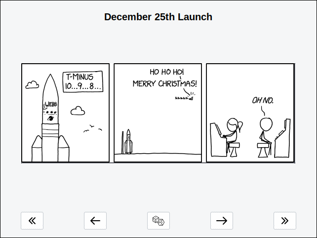

<h1 align="center">
  <b>XKCD-VIEWER</b>
</h1>

<p align="center">
  <br>
  <strong>A simple viewer for xkcd comic</strong><br>
</p>

## OVERVIEW
xkcd-viewer is a simple Python application that allows users to browse and view the popular webcomic xkcd.

## FEATURES
- **Random comic**: Users can choose to view a random comic from the xkcd archive.
- **Explain comic**: Provide a link to an external website where users can read an explanation of the current comic.
- **Save comic image**:  Users can download the current comic as an image to share.
- **Keyboard Shortcuts**: The app supports keyboard shortcuts for common actions, such as navigating between comics.

## INSTALLATION
You can install xkcd-viewer by following these steps:

* Download the repository
    ```bash
        git clone www.github.com/csq/xkcd-viewer
    ```
* Enter into the folder ``xkcd-viewer`` and execute
    ```bash
        pip install .
    ```

## DEPENDENCIES
Python versions 3.10+ are supported.

* **Certifi**: Collection of root certificates for SSL/TLS validation.
* **Urllib3**: HTTP client for making requests and handling responses.
* **Ttkthemes**: Provides customizable themes for Tkinter's Themed Widget (ttk) library.
* **Pillow**: Image processing library for opening, manipulating, and saving various image formats.

## USAGE
### Keyboard Shortcuts

| Shortcut      | Description        |
|---------------|--------------------|
| **Ctrl + F**  | First comic        |
| **Ctrl + N**  | Next comic         |
| **Ctrl + R**  | Random comic       |
| **Ctrl + P**  | Previous comic     |
| **Ctrl + L**  | Last comic         |
| **Ctrl + S**  | Save image         |
| **Ctrl + I**  | Info comic         |
| **Ctrl + T**  | Change theme       |
| **F1**        | Open help          |
| **F11**       | Fullscreen         |
| **Ctrl + Q**  | Quit               |

## CREDITS AND LEGAL
### Author
xkcd-viewer was created by [Carlos Quiroz](https://github.com/csq/)

### License
GNU General Public License v3.0 or later
See [COPYING](COPYING) to see the full text.